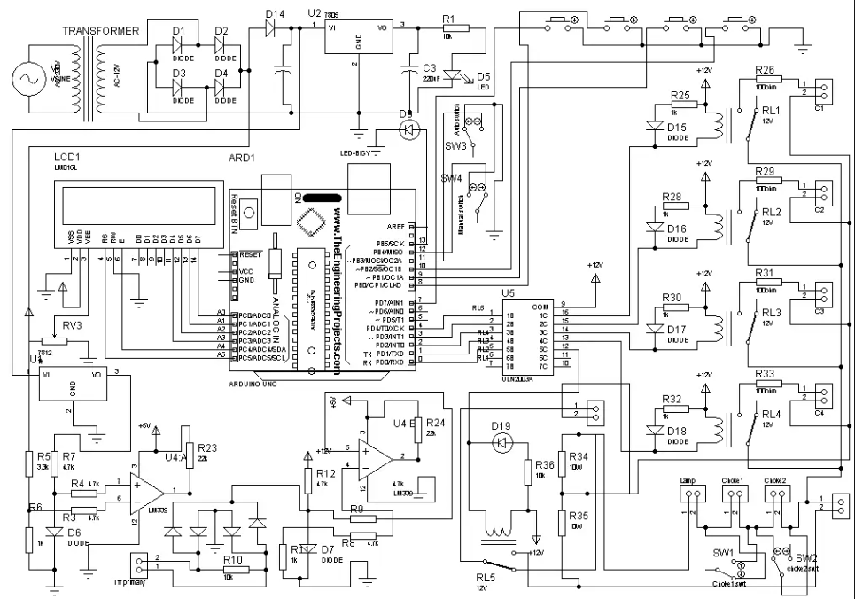

# Automatic Power Factor Correction Meter

## Project Overview
A real-time hardware-software integration system designed to optimize energy efficiency by monitoring load characteristics and dynamically adjusting power factors using microcontroller logic.

## Circuit Diagram
Here is the hardware architecture and schematic layout for the system:

## Key Results & Findings
* **Power Factor Correction:** Successfully optimized lagging power factors from ~0.72 up to an efficient 0.95.
* **Response Time:** Automated relay switching executes within milliseconds of inductive load detection.
* **Hardware Efficiency:** Minimized reactive power overhead in localized low-scale testing environments.

## Project Documentation
* View the complete formal technical report detailing the frameworks and component selection: [Project Report (PDF)](apfcreport.pdf)
* View the hardware design calculations: [Mathematical Calculations (PDF)](APFCcalcs.pdf)
